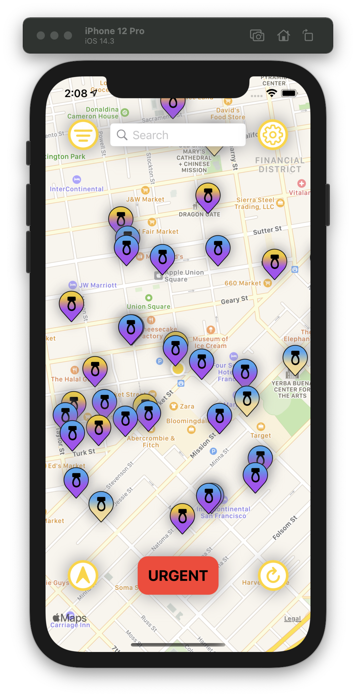
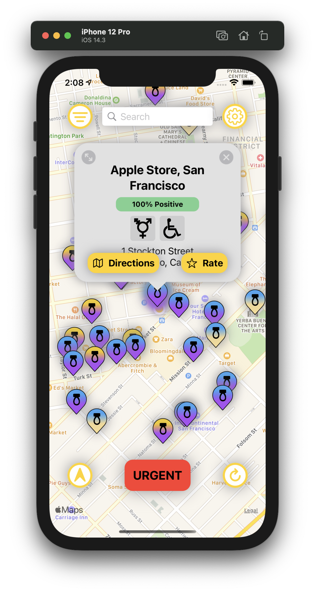
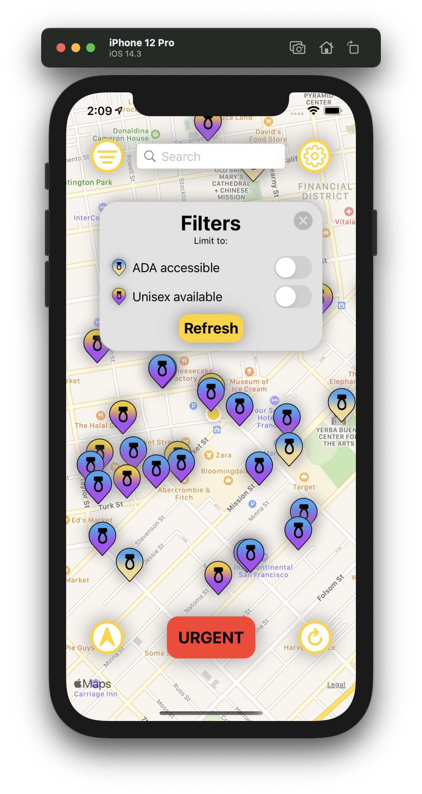
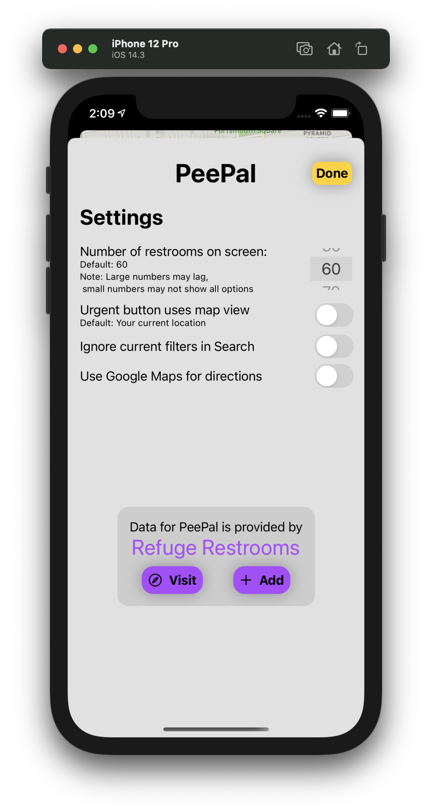
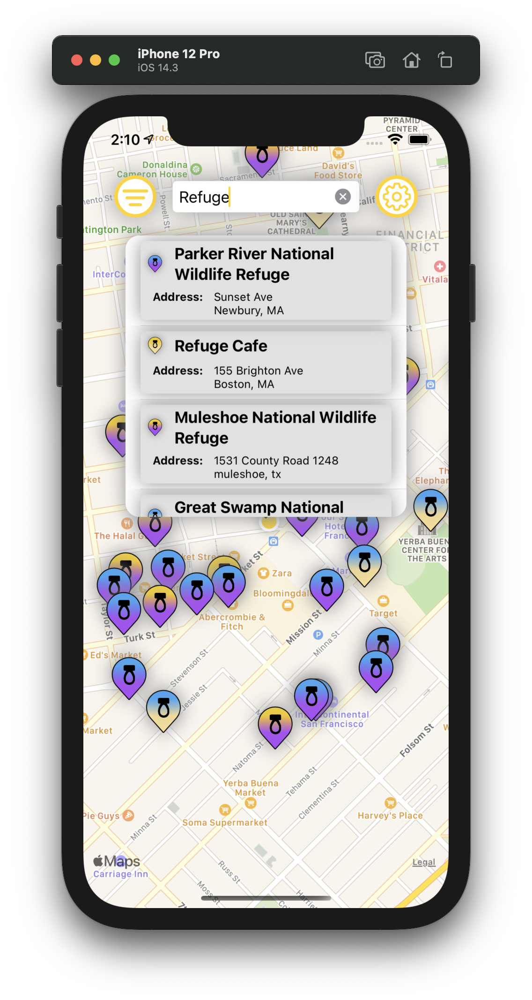
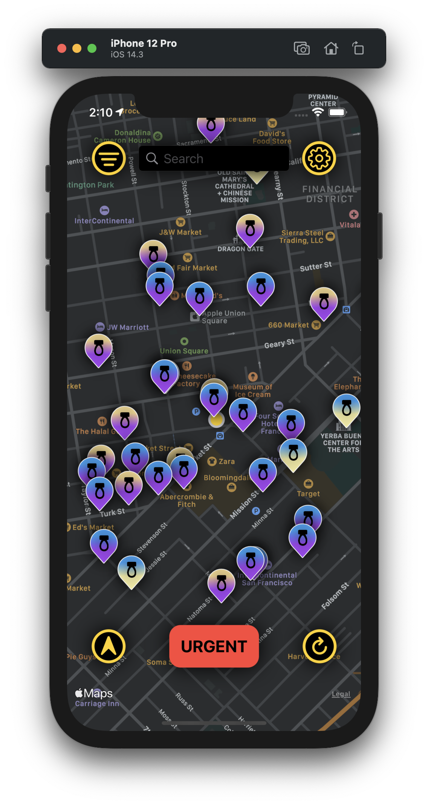

PeePal
========================

PeePal is a simple Swift/SwiftUI app implementing the Refuge Restrooms API.

## Screenshots

## API

PeePal uses the [Refuge Restrooms API](http://www.refugerestrooms.org/api/docs/).

## Installing

PeePal is currently in public beta. You can install it on iOS/iPadOS 14.2+ through <a href="https://testflight.apple.com/join/pyJft4eT">TestFlight</a>.

## License

PeePal is licenced under the GNU Affero General Public License. See the [LICENSE](https://raw.githubusercontent.com/RefugeRestrooms/refugerestrooms-ios/master/LICENSE) file for more info.
