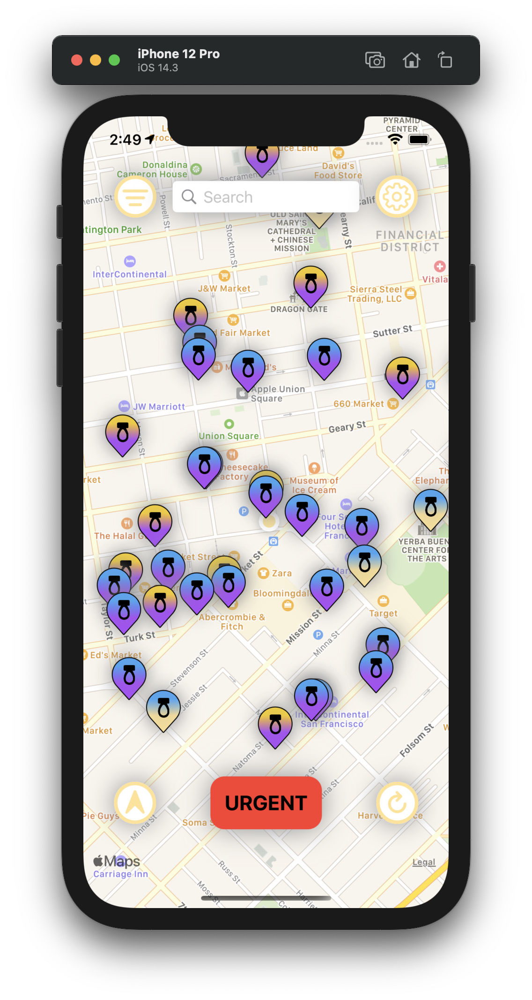

PeePal
========================

PeePal is a simple Swift/SwiftUI app implementing the Refuge Restrooms API.

## Screenshots

## API

PeePal uses the [Refuge Restrooms API](http://www.refugerestrooms.org/api/docs/).

## Installing

PeePal can be installed on iOS/iPadOS 14.2+ or on macOS 11.2+ on a Mac with Apple Silicon. It can be found on the <a href="https://apps.apple.com/us/app/peepal-refuge/id1540530097">App Store</a>.

PeePal also has a public beta version. You can install it on those same operating systems through <a href="https://testflight.apple.com/join/pyJft4eT">TestFlight</a>.

## License

PeePal is licenced under the GNU Affero General Public License. See the [LICENSE](https://raw.githubusercontent.com/RefugeRestrooms/refugerestrooms-ios/master/LICENSE) file for more info.
